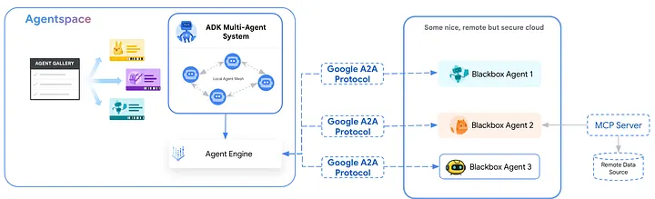
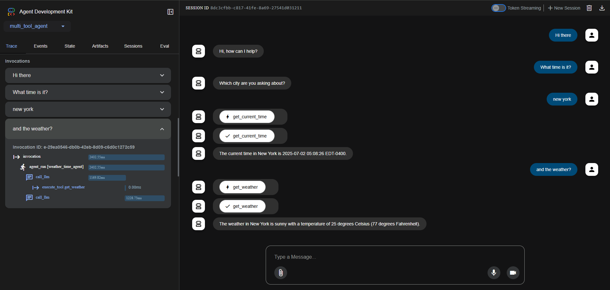

# ADK Lab

Agent Development Kit (ADK) is a flexible and modular framework for developing and deploying AI agents. While optimized for Gemini and the Google ecosystem, ADK is model-agnostic, deployment-agnostic, and is built for compatibility with other frameworks. 

ADK was designed to make agent development feel more like software development, to make it easier for developers to create, deploy, and orchestrate agentic architectures that range from simple tasks to complex workflows.




## Get started 

Create your environment

```
python -m venv venv
```

Activate the environment
```
venv\Scripts\activate
```


Install dependencies

```
pip install -r requirements.txt
```


### Enviroment variables
Create a new  .env file and add the envrionment variables.

Take a look to the .env.example file.
```
GOOGLE_GENAI_USE_VERTEXAI=FALSE
GOOGLE_API_KEY=<Your_API_KEY>
```


## Run your agent
There are multiple ways to interact with your agent:

### 1. Dev UI (adk web)

```
adk web
```


### 2. Terminal (adk run)
```
adk run multi_tool_agent
```

or
```
adk run mpc_tool_agent
```

### 3. API Server (adk api server)
**adk api_server** enables you to create a local FastAPI server in a single command, enabling you to test local cURL requests before you deploy your agent.

```
adk api_server
```

## Flow


## Demo


## References
- https://google.github.io/adk-docs/
- https://partner.cloudskillsboost.google/course_templates/1325/labs/541251
- https://cloud.google.com/vertex-ai/generative-ai/docs/models/evaluation-overview
- https://cloud.google.com/vertex-ai/generative-ai/docs/models/determine-eval
- https://cloud.google.com/vertex-ai/generative-ai/docs/models/run-evaluation
- https://cloud.google.com/vertex-ai/generative-ai/docs/models/view-evaluation